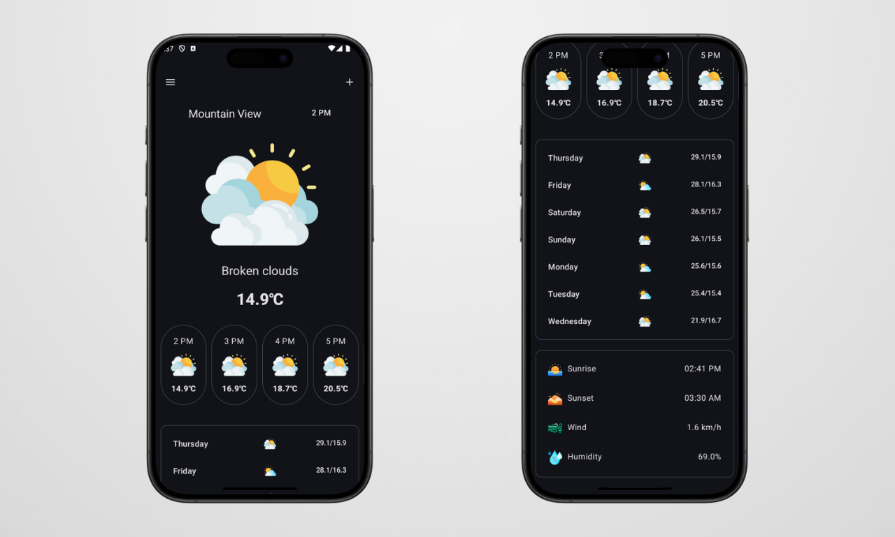

# 🌤️ Weather App

The **Weather App** provides accurate and up-to-date weather information for any location using the **Weatherbit API**. Built with **Jetpack Compose**, it’s designed for an intuitive and visually appealing experience, helping users quickly access essential weather details.

## 🌟 Features
- **Real-Time Weather**: Displays current temperature, humidity, wind speed, and other weather parameters.
- **Location-Based Forecast**: Retrieves weather based on the user's location (latitude and longitude).
- **7-Day Forecast**: Provides a detailed daily forecast for up to 7 days.
- **Hourly Forecast**: Provides a detailed hourly forecast for up to 24 hours.
- **Modern UI**: Built with Jetpack Compose for a responsive, user-friendly design.

## 📸 Screenshots


## 🛠️ Tech Stack
- **Language**: Kotlin
- **UI Framework**: Jetpack Compose
- **Networking**: Retrofit2 for API calls
- **Location**: Kotlinx-datetime for date-time handling
- **API**: Weatherbit API for weather data

## 🚀 Getting Started

1. **Clone the Repository**:
   ```bash
   git clone https://github.com/your-username/weather-app.git

2. **API Key Setup**:
   - Sign up at [Weatherbit.io](https://www.weatherbit.io/) (choose the trial plan) and get your API key.
   - Place the API key in your project by adding it to your `resources/string_values.xml` file :
     ```string_values.xml
     WEATHER_API_KEY="your_weatherbit_api_key"
     ```

3. **Build and Run**:
   - Open the project in **Android Studio**, sync dependencies, and run the app on an emulator or device.


## 🗂️ Project Structure
- `ui/`: Jetpack Compose screens for displaying weather details.
- `data/`: Handles API calls and data models.
- `viewmodel/`: Contains business logic with ViewModel and LiveData for state management.

## 💡 Learnings and Challenges
Building this **Weather App** was a hands-on experience with **Jetpack Compose** and **API integration**. Working with live data from the Weatherbit API and managing location services were among the challenging but rewarding parts of the project.


