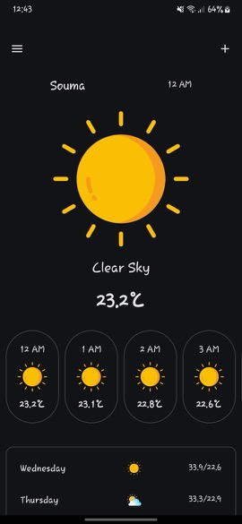

# Weather application

an application to get the weather using weatherbit api built with jetpack compose

## Technologies

 - Kotlin
 - Jetpack compose

## How to setup the application to work

- first you need to open an account in [weatherbit api](https://www.weatherbit.io/) to get your api key , choose the trial plan

- then in the application's resourses , in string values change the value of weatherbitApiKey to your api key

- now the app should work

## How the app looks like

